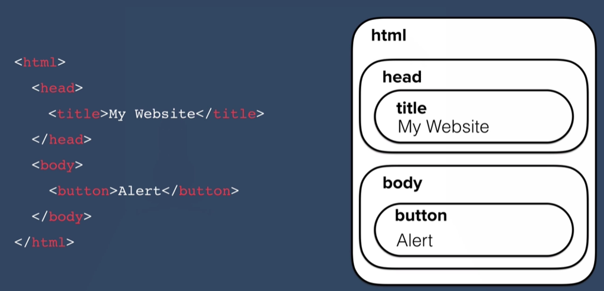
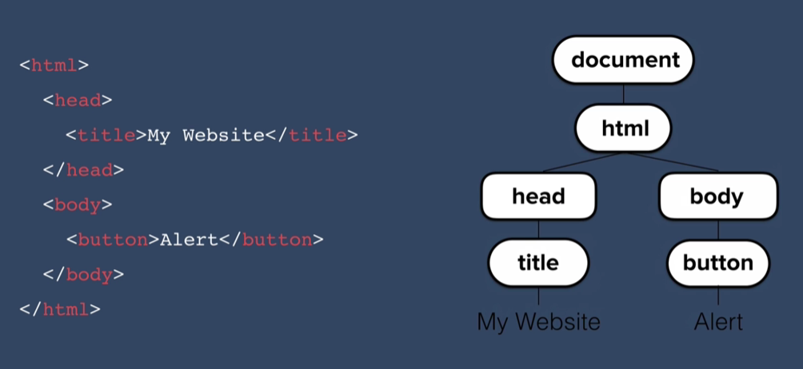

# What is DOM?

DOM or the Document Object Model basically catalogs the web page into individual objects that we can select and manipulate.

<figure>
  
  <figcaption align="center">
    <em>Figure 1: Basic Web Structure</em>
  </figcaption>
</figure>

<br/>

So on `Figure 1` on the left here we've got the HTML code of a really basic website, it's just got a head section, a body section, a title, and a button. And on the right is roughly the structure of our website that you might see in the browser.

<figure>
  
  <figcaption align="center">
    <em>Figure 2: The DOM Tree</em>
  </figcaption>
</figure>

Now, the task of converting an HTML file into the DOM is done by the browser when you load up the web page. And what it does is that it turns each of these elements and their associated data into a `tree structure` with a whole bunch of objects that you can select and manipulate. So the tree model on the right showed in `Figure 2` is usually how you'll see the DOM represented.

You can see that all of the elements in our HTML has been converted into objects, and their relationships to each other mapped out in the `tree diagram`. So, for example, the head section is a descendant of the HTML object, but the head and the body, they're siblings, they're not descendants of each other. And everything that is contained inside your HTML document is contained in an object called, "`the document`."

<figure>
  
  <figcaption align="center">
    <em>Figure 3: Properties and Methods</em>
  </figcaption>
</figure>

As you can see on `Figure 3` that our objects inside the DOM can have properties and methods. Now properties describe something about the object and the methods are the things that the object can do.

So, for example showed in `Figure 3`, let's say that our object is a `button` and has property like `innerHTML`, `style`, `firstChild` and etc..., and this button have methods like `keypress` or `click`.

```
const car = {
  name: "toyota",
  color: "red",
  numberOfDoors: 4,
}
```

Here some other example let say our object is `car` then we can say `car.color` to get the value of the property, this is what we called a `Getter`, And in this case, if we ran this code, it will give us the output of red because the current value of the color property of the car is equal to red.

```
car.numberOfDoors = 0;
```

Now with properties we can also set it so we can say `car.numberOfDoors`, so the number of doors property of car, let's change it to 0. And now our car has no doors. And this is called "`setting a property`". And you can see that the difference between `setting` a property and `getting` a property is simply whether if we assign a value to it with an equal sign.

## Difference between Function and Method?

only difference between a method and a function is that a method is something that an object can do, so it has to be associated with an object.

## Reference Links:

<a href="https://www.codecademy.com/article/fwd-js-methods-functions" target_="blank">Methods and Functions</a>

<a href="http://web.simmons.edu/~grabiner/comm244/weekfour/document-tree.html" target_="blank">Simmons University</a>

## Extensions:

<a href="https://chromewebstore.google.com/detail/html-tree-generator/dlbbmhhaadfnbbdnjalilhdakfmiffeg" target_="blank">HTML Tree Generator</a>
