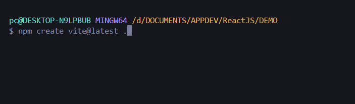
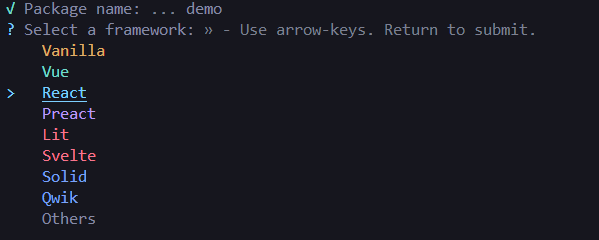
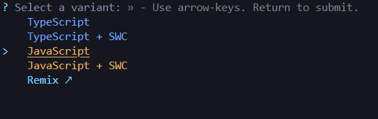
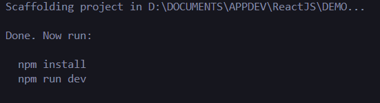
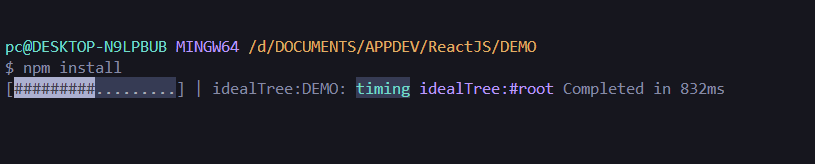
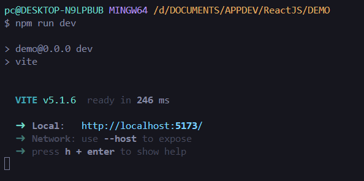

# Local Development Setup

Vite (French word for "quick", pronounced /vit/, like "veet") is a build tool that aims to provide a faster and leaner development experience for modern web projects.

Step 1. Make sure you have the latest version of Node installed. If not head over to https://nodejs.org/en/download to download the LTS (Long Term Support) version of Node.
To check the version terminal:

```
node --version
```

Step 2. Make sure you have the latest version of VSCode installed. If not, head over to https://code.visualstudio.com/download to download the version for your platform.

Step 3. Open a Terminal or command prompt and navigate to the directory where you want to create your React project.

Step 4. Create a Vite app by running the following command in your Terminal or Command Prompt:

```
npm create vite@latest .
npm create vite@latest project-name

// slower download
npx create-react-app my-react-app
```



Step 5. The first time, you won't have Vite installed. Type y to proceed. Then you'll be asked to select a framework. Use your down arrow to select React.



Step 6. You'll be asked to select a variant, select Javascript.



Step 7. Install dependencies:



When npm has installed all the necessary packages



Start 8 Start the development server:
Vite will compile your code every time your change anything and you can see the location of your development server in the output.



Step 09. Open the app in your browser by heading over to the local address shown. It's usually at http://localhost:5173/
