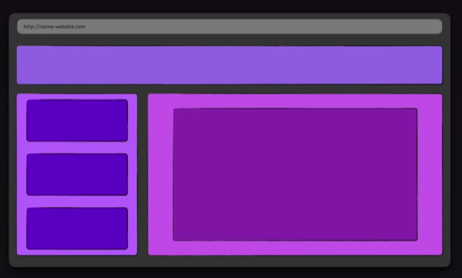

# What exactly is a component?

React components are the building blocks of React applications. They are reusable, self-contained pieces of code that define how a part of your user interface (UI) should appear and behave. In simpler terms, you can think of components as custom HTML elements that you can create to represent different parts of your web application.
<br />



## Benefits of Component-Based Development

The advantages of component-based development in React are manifold:

- Code Reusability: Components can be reused across different parts of the application, reducing development time and effort.

- Maintainability: Breaking down the UI into smaller components makes codebases easier to understand, navigate, and maintain.

- Separation of Concerns: Each component focuses on a specific aspect of the UI, promoting a clear separation of concerns and improving code organization.

- Collaboration: With components, developers can work on different parts of the application simultaneously, fostering collaboration and productivity.

## Component Structure

- Keep Components Focused: Each component should have a single, well-defined responsibility. This promotes code reusability and maintainability.
- Component Reusability: Strive to create generic components that can be reused across your application with different props.
- Stateless vs. Stateful Components: Use stateless functional components for simple UI elements without internal state. Employ stateful class components or hooks for components that manage data and require lifecycle methods.

## Creating Components:

There are two main ways to create React components:

Function Components: These are lightweight components defined as JavaScript functions that return JSX describing the UI. They are the preferred approach for most cases due to their simplicity and ease of use.

```
export default function MyComponent() {
  return (
    <div>
      <h1>Hello, World!</h1>
    </div>
  );
}
```

## Beyond React: Component-Based Paradigm in Other Frameworks

The concept of component-based development extends beyond React and is embraced by other popular frontend frameworks such as Angular, Vue.js, and Svelte. Moreover, it transcends the realm of web development, finding applications in mobile development frameworks like Flutter, ReactNative, Xamarin and etc...
